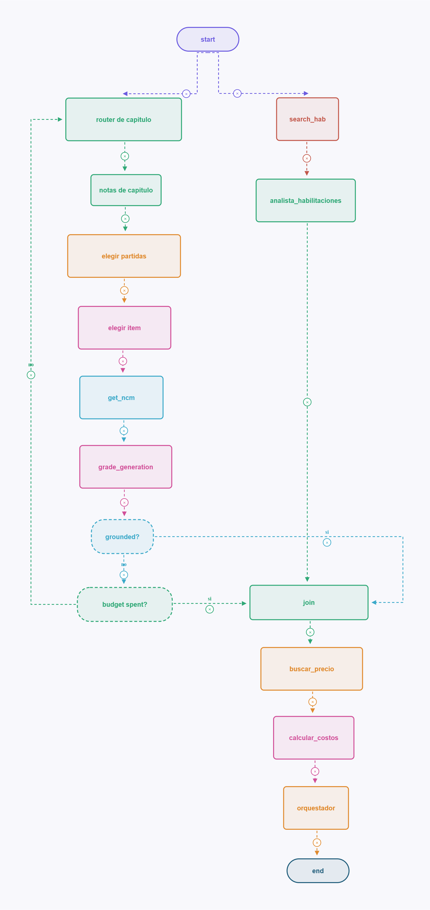

# IMPOAI

LangGraph assistant for Mercosur NCM classification, a first-pass import cost estimate, Argentine selling-price hints, and Argentina import-permit research.

This is a **budgeting tool**, not a customs filing. It does not replace a *despachante* or AFIP.

## Architecture

Target graph: NCM walk and habilitation search run **in parallel**, join, then Argentine selling price, DIE + statistical fee + VAT + perceptions + IIBB on user-entered CIF, and a written report.



## What it does today

Given a product description, **CIF**, optionally **origen**, **cantidad**, tax status and **provincia** (e.g. `pelotas de tenis CIF 100 origen China 200 unidades provincia CABA`):

1. Walk the NCM catalog (chapter → notes → heading → 6-digit subheading if the heading is long → item → code exists → grade), with up to 3 retries, **in parallel** with habilitation search
2. Estimate **DIE** as `CIF × DIE%`, plus **tasa de estadística** (3 % of CIF with USD caps; 0 if origin is Mercosur), plus **IVA 21%** on `CIF + DIE + estadística + medidas`, plus **percepción IVA** (RG 2937: 20 % / 10 % on the same base), **percepción Ganancias** (RG 2281: 11 % default monotributista, 6 % `responsable inscripto`, 3 % `responsable inscripto CVDI`) and **IIBB** if the question has **provincia** (general-rate estimate; 0 if omitted; `IIBB 3.5` overrides). If `docs/*medidas*.xlsx` is present and the question has **origen**, add matching **antidumping ad valorem**. If it also has **cantidad** and the CNCE row has a single specific rate, add `cantidad × USD/unidad`. Min FOB and ambiguous rates are reported, not liquidated.
3. Search an Argentine **selling price** (Spanish NCM text), convert ARS→USD with the BCRA **A 3500** wholesale rate (fallback `USD_ARS_RATE` in `graph/consts.py`)
5. Assemble a **report** (`reporte_final`) that labels the output as an estimate, not an AFIP filing

Classification uses a **parsed JSON catalog**, not PDF RAG. The catalog covers **all 97 NCM chapters** (`ncm/data/catalog.json`). Rebuild it offline with `python -m ncm` (needs the Mercosur PDF next to the repo root).

If `docs/nomenclador_*.txt` and `docs/capitulo_*.txt` (Arancel Integrado dumps) are present, **current Argentine DIE** overlays the catalog AEC at lookup time. If `docs/*medidas*.xlsx` (CNCE measures) is present, those rows hang off the NCM. Those files are local (gitignored).

## Setup

```powershell
python -m venv .venv
.\.venv\Scripts\activate
pip install -e ".[dev]"
copy .env.example .env
```

Fill `OPENAI_API_KEY` and `TAVILY_API_KEY` in `.env`. Never commit `.env`.

## Run

```powershell
.\.venv\Scripts\python.exe -m graph.graph
```

Edit the play button in `graph/graph.py`: put the product and the CIF in `question` (e.g. `green coffee beans CIF 4.50`). Later this will come from a chat turn.

```powershell
.\.venv\Scripts\python.exe -m pytest graph\tests ncm\tests -q
```

Branch tests mock Tavily and the LLM. A full `graph.graph` run hits live APIs.

## Layout

| Path | Role |
|---|---|
| `ncm/` | PDF parser (offline) + catalog lookup + AIA overlay |
| `ncm/data/catalog.json` | Full 97-chapter NCM (rebuild: `python -m ncm`) |
| `docs/nomenclador_*.txt` | Local Arancel Integrado dump (gitignored; DIE overlay) |
| `docs/*medidas*.xlsx` | Local CNCE dumping measures (gitignored) |
| `graph/graph.py` | LangGraph wiring |
| `graph/chains/` | LLM forms (NCM, price, hab) |
| `graph/nodes/` | State in / state out |
| `docs/architecture.png` | Target graph (LangGraph Studio export) |
| `TODO.md` | Full catalog, broker-style liquidation, FX scrape |

## Status

POC graph matches the office diagram (parallel NCM + hab → join → price → DIE on CIF → report). Next: rest of the tax stack, live USD/ARS, conversational input for CIF / province, then observability.
